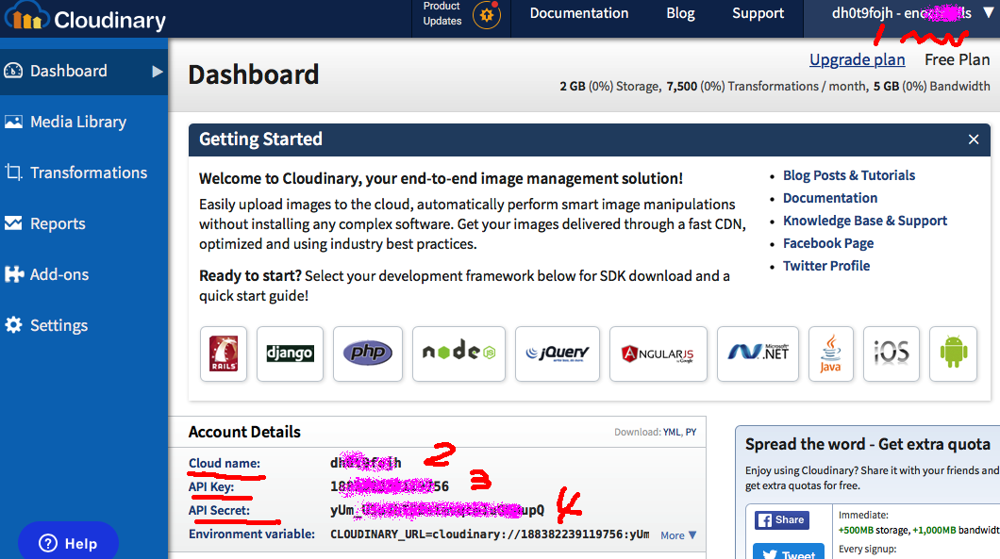

# Cloudinary-ImageUploader Demo [简体中文](README.zh_CN.md)

<p align="center">
    <a href="http://perfect.org/get-involved.html" target="_blank">
        
    </a>
</p>

<p align="center">
    <a href="https://github.com/PerfectlySoft/Perfect" target="_blank">
        
    </a>  
    <a href="http://stackoverflow.com/questions/tagged/perfect" target="_blank">
        
    </a>  
    <a href="https://twitter.com/perfectlysoft" target="_blank">
        
    </a>  
    <a href="http://perfect.ly" target="_blank">
        
    </a>
</p>
<p align="center">
    <a href="https://developer.apple.com/swift/" target="_blank">
        
    </a>
    <a href="https://developer.apple.com/swift/" target="_blank">
        
    </a>
    <a href="http://perfect.org/licensing.html" target="_blank">
        
    </a>
    <a href="http://twitter.com/PerfectlySoft" target="_blank">
        
    </a>
    <a href="http://perfect.ly" target="_blank">
        
    </a>
</p>

## Quick Start

This demo shows how to upload an image file to Cloudinary by using the latest Perfect features such as `Perfect-Crypto`, an updated version of `Perfect-CURL` with `POSTFields()` structure support (April 2017) and `Perfect-JSON` decoder as well.

Ensure you have installed and activated the latest Swift 3.1 tool chain.

### Get Your Cloudinary Tokens

Before trying this example, a [Cloudinary Account from https://cloudinary.com](https://cloudinary.com) is essentially required.


<p align="center">

</p>

Once registered, copy down these important account information from the dashboard page, as demo above:

1. Your User Name
2. Your Cloud Name
3. API Key
4. API Secret

### Download Source Code

Clone this project to your local computer, as the following command:

```
$ git clone https://github.com/PerfectExamples/Perfect-Cloudinary-ImageUploader-Demo.git
```

### Try the Demo

Now please prepare one of sample pictures to perform the test and remember the path name, for example: `/tmp/mypic.png`.

Then open the `Tests` folder for `CloudinaryTests.swift` and customize it to all above settings:

``` swift
func testExample() {
		// please change all these strings to your settings
      let cloud = Cloudinary(
      cloud_name: "your cloud name here", 
      user_name: "your user name here", 
      api_key: "your api key", 
      api_secret: "your api secret")
      do {
      	// please make sure that a valid path to your image file to upload
        let r = try cloud.upload(fileName: "/tmp/mypic.png")
        print(r)
      }catch(let err) {
        XCTFail(err.localizedDescription)
      }
    }

```

Once completed, simply run `$ swift test` in your terminal, and some interesting positive responses should pop up:

```
Compile Swift Module 'Cloudinary' (1 sources)
Compile Swift Module 'CloudinaryTests' (1 sources)
Linking ./.build/debug/CloudinaryPackageTests.xctest/Contents/MacOS/CloudinaryPackageTests
Test Suite 'All tests' started at 2017-04-11 10:45:13.276
Test Suite 'CloudinaryPackageTests.xctest' started at 2017-04-11 10:45:13.277
Test Suite 'CloudinaryTests' started at 2017-04-11 10:45:13.277
Test Case '-[CloudinaryTests.CloudinaryTests testExample]' started.
["format": "png", 
"etag": "6cc23320d763b4a6272e44a208b796eb", 
"width": 200, 
"original_filename": "mypic", 
"tags": ["YOU USER NAME APPEARED HERE"], 
"type": "upload", 
"signature": "YOUR_DIGTAL_SIGNATURE_FOR_HERE", 
"height": 200, 
"bytes": 18574, 
"secure_url": "https://res.cloudinary.com/YOUR_ACCOUNT_NAME/image/upload/SOME_PATH/SOME_FILE_NAME.png", 
"created_at": "2017-04-11T14:45:14Z", 
"resource_type": "image", 
"version": 1491921914, 
"public_id": "PUBLIC_ID_OF_THE_UPLOADED_FILE", 
"url": "http://res.cloudinary.com/YOUR_ACCOUNT/image/upload/SOME_PATH/SOME_FILE_NAME.png"]
Test Case '-[CloudinaryTests.CloudinaryTests testExample]' passed (1.017 seconds).
```

Then your image file should appear in the Media Library on Cloudinary, Cheers!

### Go Deeper

If looked into the source, the actually key part of this example is only a few lines.

Firstly, the demo encodes user name / secret with a timestamp int a `signature`:

``` swift

// get the current time
let timestamp = time(nil)


// combine the api secret with your name and timestamp
let value = "tags=\(user_name)&timestamp=\(timestamp)\(api_secret)"


// encode the whole string with SHA-1 algorithm
guard let sha1 = value.digest(.sha1)?.encode(.hex),

// generate the signature - now your secret
let signature = String(validatingUTF8:sha1) 
```

Secondly, a `CURL.POSTFields` structure has been applied to store all the settings:

``` swift
let fields = CURL.POSTFields()
_ = fields.append(key: "timestamp", value: "\(timestamp)")
_ = fields.append(key: "api_key", value: api_key)
_ = fields.append(key: "signature", value: signature)
_ = fields.append(key: "tags", value: user_name)
_ = fields.append(key: "file", path: fileName)
```

The third step, which is the final step, is to call a CURL command which is actually performing the upload:

```
let curl = CURL(url: "https://api.cloudinary.com/v1_1/\(cloud_name)/\(resource_type)/upload")
let ret = curl.formAddPost(fields: fields)
let r = curl.performFullySync()
```

With an extra tip, the demo also provides a very good example of safely decode the JSON response from Cloudinary:

``` swift
var ptr = r.bodyBytes
// append a zero to the body buffer is a good idea to complete a NULL-terminated string
ptr.append(0)

let s = String(cString: ptr)
guard r.resultCode == 0, r.responseCode == 200 else {
	// throw something here
}//end guard

// decode the json expression
return try s.jsonDecode() as? [String:Any] ?? [:]
```

⚠️*NOTE*⚠️ The actual calling procedure of the above demo is equivalent to the CURL command:

```
$ curl -X POST \
	-F timestamp=YOUR_TIME_STAMP  \
	-F api_key=YOUR_API_KEY \
	-F signature=YOUR_SIGNATURE \
	-F tags=YOUR_USER_NAME
	-F file=@/tmp/mypic.png
	"https://api.cloudinary.com/v1_1/YOUR_CLOUD_NAME/RESOUCE_TYPE/upload"
``` 

## Issues

We are transitioning to using JIRA for all bugs and support related issues, therefore the GitHub issues has been disabled.

If you find a mistake, bug, or any other helpful suggestion you'd like to make on the docs please head over to [http://jira.perfect.org:8080/servicedesk/customer/portal/1](http://jira.perfect.org:8080/servicedesk/customer/portal/1) and raise it.

A comprehensive list of open issues can be found at [http://jira.perfect.org:8080/projects/ISS/issues](http://jira.perfect.org:8080/projects/ISS/issues)

## Further Information
For more information on the Perfect project, please visit [perfect.org](http://perfect.org).

## Now News about Perfect is Available in WeChat (Simplified Chinese Only)
<p align="center">

</p>
