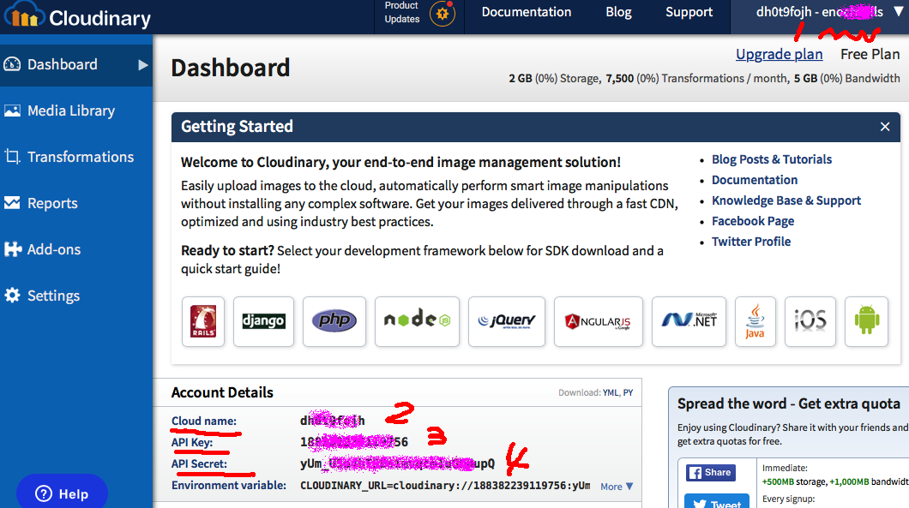

# Cloudinary云图片上载示范程序 [English](README.md)

<p align="center">
    <a href="http://perfect.org/get-involved.html" target="_blank">
        
    </a>
</p>

<p align="center">
    <a href="https://github.com/PerfectlySoft/Perfect" target="_blank">
        
    </a>  
    <a href="http://stackoverflow.com/questions/tagged/perfect" target="_blank">
        
    </a>  
    <a href="https://twitter.com/perfectlysoft" target="_blank">
        
    </a>  
    <a href="http://perfect.ly" target="_blank">
        
    </a>
</p>
<p align="center">
    <a href="https://developer.apple.com/swift/" target="_blank">
        
    </a>
    <a href="https://developer.apple.com/swift/" target="_blank">
        
    </a>
    <a href="http://perfect.org/licensing.html" target="_blank">
        
    </a>
    <a href="http://twitter.com/PerfectlySoft" target="_blank">
        
    </a>
    <a href="http://perfect.ly" target="_blank">
        
    </a>
</p>

## 快速上手

本项目展示了如何用Swift语言快速将图片上传到Cloudinary，并且使用了Perfect函数库中的最新功能诸如`Perfect-Crypto`加密函数库、带有`POSTFields`表单提交控制数据结构的新版`Perfect-CURL`（2017年4月），以及`Perfect-JSON`解码工具等等。

请确认您的计算机上安装了最新版本的Swift 3.1 tool chain工具链。

### 获取 Cloudinary 通行证

在使用本项目之前，您需要一个有效的[Cloudinary 账号，在这里注册：https://cloudinary.com](https://cloudinary.com) 。


<p align="center">

</p>

一旦注册成功，请在欢迎页面仪表盘中将图示中的关键信息抄录下来，内容必须包括：

1. 用户名
2. 您的Cloudinary 云名称“Cloud Name”
3. API Key 应用程序接口服务钥匙
4. API Secret 应用程序接口服务密码

### 下载源程序

请将本项目下载到您的计算机，如下命令所示：

```
$ git clone https://github.com/PerfectExamples/Perfect-Cloudinary-ImageUploader-Demo.git
```

### 测试一下

请自行准备一个图片文件，并记录其关键路径名称，比如：`/tmp/mypic.png`.

然后打开项目文件夹，在 `Tests`测试目录下面找到 `CloudinaryTests.swift`，用编辑器打开并输入之前都准备好的参数：

``` swift
func testExample() {
		// 请将下列字符串变量手工改为您自己的程序配置
      let cloud = Cloudinary(
      cloud_name: "您的云名称，Cloud Name", 
      user_name: "用户名", 
      api_key: "api key 应用程序接口服务钥匙", 
      api_secret: "your api 应用程序接口服务密码")
      do {
      	// 请确保要上传的图片文件具有有效的路径名称：
        let r = try cloud.upload(fileName: "/tmp/mypic.png")
        print(r)
      }catch(let err) {
        XCTFail(err.localizedDescription)
      }
    }

```

编辑完毕并保存文件后，只需要在终端内运行 `$ swift test` 就可以看到服务器返回的一些有趣的响应：

```
Compile Swift Module 'Cloudinary' (1 sources)
Compile Swift Module 'CloudinaryTests' (1 sources)
Linking ./.build/debug/CloudinaryPackageTests.xctest/Contents/MacOS/CloudinaryPackageTests
Test Suite 'All tests' started at 2017-04-11 10:45:13.276
Test Suite 'CloudinaryPackageTests.xctest' started at 2017-04-11 10:45:13.277
Test Suite 'CloudinaryTests' started at 2017-04-11 10:45:13.277
Test Case '-[CloudinaryTests.CloudinaryTests testExample]' started.
["format": "png", 
"etag": "6cc23320d763b4a6272e44a208b796eb", 
"width": 200, 
"original_filename": "原图片文件名会出现在这里", 
"tags": ["用户名会出现在这里"], 
"type": "upload", 
"signature": "这里是为这张图片进行的数码签名", 
"height": 200, 
"bytes": 18574, 
"secure_url": "https://res.cloudinary.com/账户名称/image/upload/路径/文件名.png", 
"created_at": "2017-04-11T14:45:14Z", 
"resource_type": "image", 
"version": 1491921914, 
"public_id": "已上传文件的公开名称", 
"url": "http://res.cloudinary.com/账户名称/image/upload/路径/文件名.png"]
Test Case '-[CloudinaryTests.CloudinaryTests testExample]' passed (1.017 seconds).
```

这时您的Cloudinary的媒体库上应该看到新上传的文件了吧？庆祝一下！

### 深入探秘

如果您详细观察源代码，可以发现核心部分只有少数几行：

首先，示范代码将用户名和应用程序接口密码混合到时间戳以生成数字签名`signature`:

``` swift

// 获取当前时间戳
let timestamp = time(nil)


// 将应用程序服务接口密码和用户名混合并加入时间戳
let value = "tags=\(user_name)&timestamp=\(timestamp)\(api_secret)"


// 采用 SHA-1 算法加密
guard let sha1 = value.digest(.sha1)?.encode(.hex),

// 生成数字签名字符串
let signature = String(validatingUTF8:sha1) 
```

第二步，调用`CURL.POSTFields`数据结构以保存之前准备的所有变量：

``` swift
let fields = CURL.POSTFields()
_ = fields.append(key: "timestamp", value: "\(timestamp)")
_ = fields.append(key: "api_key", value: api_key)
_ = fields.append(key: "signature", value: signature)
_ = fields.append(key: "tags", value: user_name)
_ = fields.append(key: "file", path: fileName)
```

第三步也就是最后一步，是调用CURL命令执行上传：

```
let curl = CURL(url: "https://api.cloudinary.com/v1_1/\(cloud_name)/\(resource_type)/upload")
let ret = curl.formAddPost(fields: fields)
let r = curl.performFullySync()
```

这里再买一送一，程序中还演示了如何安全地针对Cloudinary服务器返回内容进行JSON解码：

``` swift
var ptr = r.bodyBytes
// 返回的数据末尾增加一个零是用于处理字符串的一个好主意
ptr.append(0)

let s = String(cString: ptr)
guard r.resultCode == 0, r.responseCode == 200 else {
	// 出错了！
}//end guard

// 进行 JSON 解码
return try s.jsonDecode() as? [String:Any] ?? [:]
```

⚠️*注意*⚠️ 实际上以上整个程序完全等同于一个CURL命令：

```
$ curl -X POST \
	-F timestamp=当前时间戳  \
	-F api_key=应用程序服务接口钥匙 \
	-F signature=数字签名 \
	-F tags=用户名 \
	-F file=@/tmp/mypic.png \
	"https://api.cloudinary.com/v1_1/YOUR_CLOUD_NAME/RESOUCE_TYPE/upload"
``` 

## 问题报告、内容贡献和客户支持

我们目前正在过渡到使用JIRA来处理所有源代码资源合并申请、修复漏洞以及其它有关问题。因此，GitHub 的“issues”问题报告功能已经被禁用了。

如果您发现了问题，或者希望为改进本文提供意见和建议，[请在这里指出](http://jira.perfect.org:8080/servicedesk/customer/portal/1).

在您开始之前，请参阅[目前待解决的问题清单](http://jira.perfect.org:8080/projects/ISS/issues).


## 更多信息
关于本项目更多内容，请参考[perfect.org](http://perfect.org).

## 扫一扫 Perfect 官网微信号
<p align="center">

</p>
